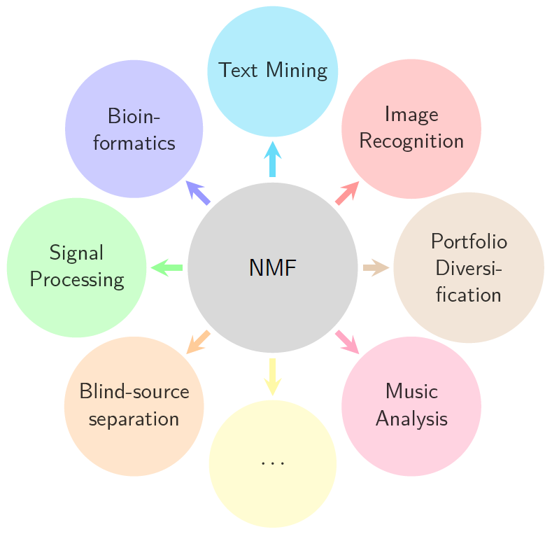
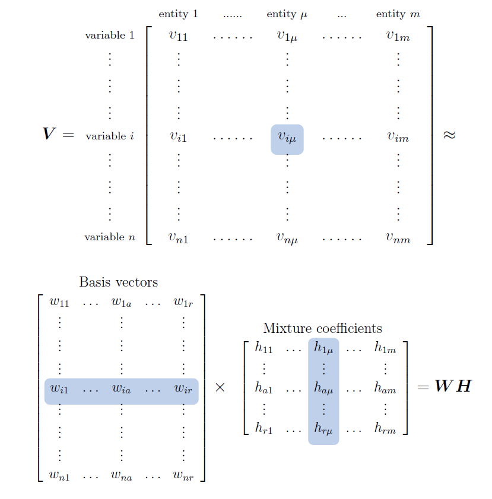
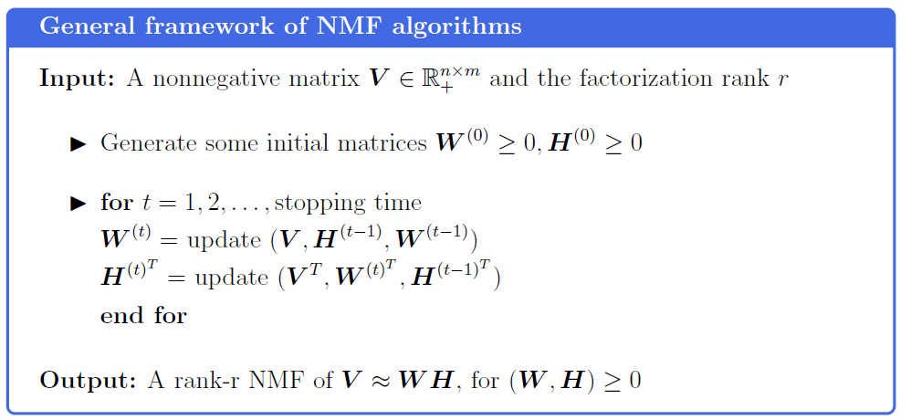
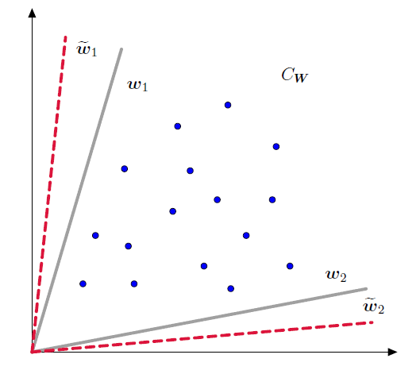

<style>
body {
  text-align: justify
}
.page p {
  color: #000000;
}
img {
  display: block;
  margint: auto;
}
code {
  color: #236e51
}
.citation {
  color: #4745de
}
a {
  color: #4745de
}
</style>

```{r setup, include=FALSE}
library(rmarkdown)
library(knitr)
library(rmdformats)
library(kableExtra)
library(ggplot2)
knitr::opts_chunk$set(warning = FALSE, message = FALSE, echo = TRUE, dpi = 400)

show_table <- function(x, caption = "", head = 50, scroll = FALSE, full.width = FALSE, 
                       digits = 2, col.names = NA, align = NULL){
  table <- x %>%
    head(head) %>%
    kable(caption = caption, digits = digits, col.names = col.names, align = align,
          format.args = list(decimal.mark = ".", big.mark = ",")) %>%
    kable_styling("striped", position = "left", full_width = full.width)
    if(scroll){
      table <- table %>%
        scroll_box(width = "100%", height = "500px")
    }
  return(table)
}
```

\newcommand{\norm}[1]{\left\lVert #1 \right\rVert}
\definecolor{myblue}{rgb}{0.24,0.29,1.00} 

# Introduction

The recent developments in technology have resulted in increasing quantities of data, rapidly overwhelming many of the classical analysis tools available. Processing this massive amount of data requires powerful methods for their representation and dimension reduction.

Several real-world applications frequently deal with nonnegative data. Examples of nonnegative data include pixel intensities composing an image, amplitude spectra, occurrence counts of a particular event,  scores achieved by users, and stock market values. 

However, it is not advisable to use popular matrix factorizations (e.g., *singular value decomposition*, SVD) and dimension reduction tools (e.g., *factor analysis*, *principal component analysis*, and *cluster analysis*) on this data since they cannot guarantee to preserve the nonnegativity.

Despite its various strengths (e.g., optimality property, fast and robust computation, unique factorization, and orthogonality), SVD does not reveal anything about the data collection, since the factors provide no interpretability. The nonnegativity constraint makes much of the classical techniques inapplicable to the present case [@press1989numerical] and has opened the way to the development of **nonnegative matrix factorization** (NMF).

NMF has appeared in slightly different flavors firstly in @jeter1981note, under the name of *nonnegative rank factorization*, then in @paatero1994positive, under the historically unfortunate name of *positive matrix factorization*. However, it was only after the publication of the article *"Learning the parts of objects by non-negative matrix factorization"* by @lee1999learning that this technique gathered the deserved credit and attention.

Nowadays, NMF stands out as one of the most popular low-rank approximations used for compression, visualization, feature selection, and noise filtering. It replaces the original data with a lower-dimensional representation obtained via subspace approximation. That is, it constructs a set of basis elements such that the linear space that they span approximates the data points as closely as possible. Such basis elements can then be used for identification and classification, which makes NMF a powerful unsupervised learning technique that automatically clusters similar elements into groups. This also makes it a valuable alternative to common cluster algorithms, like $k$-*means*.

NMF can be also regarded as a possible substitute of principal component analysis in the context of feature learning, of hidden Markov models in the field of temporal segmentation, of independent component analysis in the area of filtering and source separation, and of vector quantization in coding applications. By providing a low-rank approximation, the nonnegative decomposition maximizes hardware efficiency, since the low-rank matrix requires less storage than the original one. On top of that, it provides a cleaner and more efficient representation of the relationship between data elements.

The fields where NMF has been successfully applied for the analysis of high dimensional data are countless. Some examples include:

* **Image processing** to recognize the main traits of a face;
* **Text mining** to recover the main topics of a set of documents;
* **Bioinformatics** and **computational biology** for molecular pattern discovery
* **Signal processing**;
* **Air emission control**;
* **Blind-source separation** to separate voices in speech mixtures, to separate voice from background, or to separate a singing voice from accompaniment or musical instruments in polyphonic mixtures;
* **Music analysis and transcription** to recognize musical notes played by piano, drums, or multiple instruments;
* **Collaborative filtering**;
* **Community detection**;
* **Portfolio diversification**.

{width=450px}

Many other disciplines are expected to employ NMF in the near future due to its innate ability to automatically extract sparse, meaningful, and easily-interpretable features from a set of nonnegative data.


# The Method

Nonnegative matrix factorization decomposes multivariate data (arranged in a matrix-like format) by searching for the latent features that are presumed to be responsible for the generation of the directly observable variables [@nakayama1992experiencing]. One suitable way to characterize the interrelationships between multiple variables is assuming that each element of the data matrix is a linearly weighted score by a specific entity based on several factors. 

Specifically, a set of multivariate $n$-dimensional nonnegative data vectors are placed in the columns of an $n\times m$ matrix $\boldsymbol V$ (*target matrix*), where $m$ is the number of entities. The target matrix is then approximately factorized into the product of two nonnegative factor matrices, an $n \times r$ matrix $\boldsymbol W$ and an $r \times m$ matrix $\boldsymbol H$, such that:

\begin{equation*}
   \boldsymbol V   \approx  \boldsymbol W \boldsymbol H \qquad \text{with } (\boldsymbol W, \boldsymbol H) \ge 0,
\end{equation*}

where the columns in $\boldsymbol V = \Big[ \boldsymbol v_1 \ldots \boldsymbol v_{\mu} \ldots \boldsymbol v_m \Big]$ represent the data points, those in $\boldsymbol W = \Big[ \boldsymbol w_1 \ldots \boldsymbol w_{a} \ldots \boldsymbol w_r \Big]$ the latent features, and those in $\boldsymbol H = \Big[ \boldsymbol h_1 \ldots \boldsymbol h_{\mu} \ldots \boldsymbol h_m \Big]$ the coordinates of each data point in the factor matrix $\boldsymbol W$.

The rank $r$ of the factorization is generally chosen to be smaller than $n$ or $m$ (i.e., $r << min(n,m)$), and such that $(n+m)r < nm$, so that $\boldsymbol W$ and $\boldsymbol H$ are smaller than $\boldsymbol V$ and hence their product can be regarded as a compressed form of the original data matrix. In this way, the information contained in $\boldsymbol V$ can be summarized and split into $r$ factors. <br/> This parameter plays a crucial role: too high a value could result in potentially serious overfitting problems, whereas too small a value could lead to a bad representation of the data.

The matrix $\boldsymbol W$ is called *basis matrix* since its column vectors approximately form a basis for the vector space spanned by the columns of $\boldsymbol V$. Since relatively few basis vectors are used to represent many data vectors, a good approximation can only be achieved if the factors discover the true latent structure present in the data. <br/> The matrix $\boldsymbol H$ is called *mixture coefficients matrix* since its column vectors provide the weights that are used in the linear combination of the columns of the basis matrix to reconstruct the target matrix.

The NMF approximation statement can be equivalently rewritten elementwise as 

\begin{equation*}
v_{i\mu } \approx (\boldsymbol W \boldsymbol H)_{i\mu} = \sum_{a=1}^{r} w_{ia} h_{a\mu}, \qquad \text{for } i=1, \ldots, n, \text{ and } \mu=1, \ldots, m,
\end{equation*}

where the element $v_{i\mu}$ of the target matrix is the score obtained by entity $\mu$ on variable $i$, $w_{ia}$ is the loading of variable $i$ on factor $a$, and $h_{a\mu}$ is the response of entity $\mu$ to factor $a$.

{width=600px}


The nonnegativity constraints placed on the elements of the factor matrices are compatible with the intuitive notion of additively combining parts (that is, subsets of the visible variables activated by specific factors) to generate the whole representation, which is how NMF learns a parts-based representation.

The columns of the matrices $\boldsymbol W$ and $\boldsymbol H$ are often sparse since they generally contain a large portion of vanishing coefficients. **Sparseness** is one of the greatest strengths of NMF, since a sparse representation represents the majority of data by using only few active factors, making the feature set and the coefficients easier to interpret.


# Matrix factorization

The factorization of the matrix $\boldsymbol V$ can be achieved through numerical algorithms, that find at each iterations new values of $\boldsymbol W$ and $\boldsymbol H$ minimizing a certain cost function.

The majority of them uses a block coordinate descendent scheme, namely, they optimize a loss function with respect to alternatively one of the two matrices, $\boldsymbol W$ or $\boldsymbol H$, while keeping the other fixed. The justification for using such an approach is that whereas the nonlinear optimization problem is not simultaneously convex in both $\boldsymbol W$ and $\boldsymbol H$, the subproblem in either the basis matrix or the coefficients matrix is indeed convex. Since the problem is also generally symmetric in $\boldsymbol W$ and $\boldsymbol H$, most algorithms actually focus on updating only one among the two matrices and use the same update even for the other one.


Every algorithm of this type is repeated until a convergence criterion is met, which is typically performing the numerical operations for a fixed number of iterations. Although the natural stopping criterion would be terminating the procedure whenever $\left \lVert \boldsymbol V - \boldsymbol W \boldsymbol H \right \rVert \le \epsilon$, for any positive $\epsilon$, the computational effort to check this requirement is huge. Therefore, the widely shared choice is fixing a priori a number of iterations. <br/> Most NMF algorithms adhere to the following framework.



The estimation procedures developed for NMF differ for two main aspects: the *objective function* that represents the quality of the data representation, and the *numerical algorithm* employed to optimize it.

## Objective function

To find an approximate factorization $\boldsymbol  V \approx \boldsymbol W \boldsymbol H$, one needs to define a loss functions $L(\boldsymbol V, \boldsymbol W \boldsymbol H)$ quantifying the quality of the approximation. Common cost functions are based on the square Euclidean distance between the two nonnegative matrices $\boldsymbol V$ and $\boldsymbol W \boldsymbol H$ [@lee1997unsupervised; @paatero1997least]:

\begin{equation*}
L(\boldsymbol V, \boldsymbol W \boldsymbol H) = \norm{\boldsymbol V-\boldsymbol W \boldsymbol H}^2 = \sum_{i=1}^{n} \sum_{\mu = 1}^{m} \Big(v_{i\mu} - (\boldsymbol W \boldsymbol H)_{i\mu}\Big)^2.
\end{equation*}

This loss function equivalently represents the square Froebenius norm of the error. It implicitly assumes that the noise $\boldsymbol N$ present in the matrix $\boldsymbol V = \boldsymbol W \boldsymbol H + \boldsymbol N$ is Gaussian  [^1]. 

Though reasonable in many practical situations, a Gaussian noise may not be the best choice with sparse nonnegative data. For this reason, other objective functions are more used in practice, like the generalized Kullback-Leibler divergence of $\boldsymbol V$ from $\boldsymbol W \boldsymbol H$  [^2]:

\begin{equation*}
L(\boldsymbol V, \boldsymbol W \boldsymbol H) = D(\boldsymbol V\lvert \rvert \boldsymbol W \boldsymbol H) = \sum_{i=1}^{n} \sum_{\mu = 1}^{m} \Big(v_{i\mu} \log \frac{v_{i\mu}}{(\boldsymbol W \boldsymbol H)_{i\mu}} - v_{i\mu} + (\boldsymbol W \boldsymbol H)_{i\mu}\Big).
\end{equation*}

[^1]: From a statistical viewpoint, minimizing the Euclidean distance is equivalent to the optimization of the maximum likelihood criterion for a Gaussian probability distribution, where $v_{i\mu} \sim \mathcal{N}\Big((\boldsymbol W \boldsymbol H)_{i\mu}, \sigma^2\Big)$.

[^2]: The minimization of the generalized Kullback-Leibler divergence is equivalent to the optimization of the maximum likelihood criterion for a Poisson probability distribution, where $v_{i\mu} \sim \text{Poi}\Big( (\boldsymbol W \boldsymbol H)_{i\mu}\Big)$

Both measures are lower bounded by zero, and vanish if and only if $\boldsymbol V = \boldsymbol W \boldsymbol H$, but whereas the former is a distance, the latter is not, since it is not symmetric in $\boldsymbol V$ and $\boldsymbol W \boldsymbol H$. In particular, it reduces to the relative entropy [@kullback1951information] when $\sum_{i=1}^{n} \sum_{\mu = 1}^{m} v_{i\mu} = \sum_{i=1}^{n} \sum_{\mu = 1}^{m} (\boldsymbol W \boldsymbol H)_{i\mu} = 1$, so that $\boldsymbol V$ and $\boldsymbol W \boldsymbol H$ can be regarded as normalized probability distributions.

The nonlinear optimization problem is then minimizing the objective function with respect to the matrix factors, subject to the nonnegativity constraint. In practice, an optional regularization function $R(\boldsymbol V, \boldsymbol W \boldsymbol H)$ is usually added to the cost function to enforce desirable properties on the factor matrices (e.g., smoothness or sparsity):

\begin{equation*}
\min_{\boldsymbol W, \boldsymbol H \ge 0} \Big[ L(\boldsymbol V, \boldsymbol W \boldsymbol H) + R (\boldsymbol V, \boldsymbol W \boldsymbol H) \Big].
\end{equation*}

A sequence of matrices $(\boldsymbol W^{(t)}, \boldsymbol H^{(t)})$ is built such that at each step the value of the objective function is reduced. @lee1999learning pointed out that the exact form of the objective function is not as crucial as the nonnegativity constraints for the success of the factorization.


## Numerical algorithms {.tabset .tabset-pills}

The sequences of matrices $(\boldsymbol W^{(t)}, \boldsymbol H^{(t)})$ may also differ in the choice of the optimization technique used to update them. The cost functions are convex in either $\boldsymbol W$ or $\boldsymbol H$, and not simultaneously in both variables. This implies that only convergence to stationary points may eventually be guaranteed. Unlike the unconstrained optimization problem which can efficiently be solved using SVD, the complexity of NMF is generally *NP-hard*   [^3] [@vavasis2009complexity]. For real-world problems, however, even local minima are useful as they also provide the desirable properties of data compression and feature extraction.

[^3]: Recently, @arora2013practical described a subclass of nonnegative matrices (near separable matrices) for which NMF can be solved efficiently.

The numerical techniques that can be applied to find local minima can be classified into three categories.


### Multiplicative update rules

Multiplicative update rules are by now the most employed numerical algorithm to solve NMF due to their tradeoff between speed, ease of implementation for solving the optimization problem, and desirable properties. They were proposed as the numerical algorithm for solving NMF by @lee2001algorithms, whose article launched the research on this topic. 

They can be divided into two main classes, depending on the choice of the objective function. 

* Loss function based on the divergence measure: $D(\boldsymbol V\lvert \rvert \boldsymbol  W \boldsymbol H)$ is
invariant if and only if $\boldsymbol W$ and $\boldsymbol H$ are at a stationary point of the divergence, and it is non increasing under the updates:

\begin{eqnarray*}
  \quad h_{a\mu} & \leftarrow & h_{a\mu} \dfrac{\sum_{i=1}^{n} w_{ia} \dfrac{v_{i\mu}}{\left(\boldsymbol W \boldsymbol H\right)_{i\mu}}}{\sum_{i=1}^{n} w_{ia}} \quad a= 1, \ldots, r \quad \mu = 1, \ldots, m, \\[0.2cm]
  \quad w_{ia} & \leftarrow &  w_{ia} \dfrac{\sum_{\mu=1}^{m} h_{a\mu} \dfrac{ v_{i\mu}}{\left(\boldsymbol W\boldsymbol H\right)_{i\mu}}}{\sum_{\mu=1}^{m} h_{a\mu}} \quad i=1, \ldots, n \quad a= 1, \ldots, r.
\end{eqnarray*}

* Loss function based on the square Euclidean distance: $\norm{\boldsymbol V-\boldsymbol W\boldsymbol H}$ is invariant if and only if $\boldsymbol W$ and $\boldsymbol H$ are at a stationary point of the distance, and it is non increasing under the updates:

\begin{eqnarray*}
  \quad h_{a\mu} & \leftarrow & h_{a\mu} \frac{\left(\boldsymbol W^T \boldsymbol V\right)_{a\mu}}{\left(\boldsymbol W^T\boldsymbol W\boldsymbol H\right)_{a\mu}} \quad a= 1, \ldots, r \quad \mu = 1, \ldots, m, \\
  \quad w_{ia}   & \leftarrow &  w_{ia} \frac{\left(\boldsymbol  V\boldsymbol H^T\right)_{ia}}{\left(\boldsymbol W\boldsymbol H\boldsymbol H^T\right)_{ia}}  \quad i=1, \ldots, n \quad a= 1, \ldots, r.
\end{eqnarray*}

Each update consists of a multiplication by a term, which is unity when $\boldsymbol V= \boldsymbol W \boldsymbol H$, so that the perfect reconstruction of the data is necessarily a fixed point of the update rules. The fidelity of the approximation enters the updates through the normalized quotient $\dfrac{v_{i\mu}}{\left(\boldsymbol W \boldsymbol H \right)_{i\mu}}$.

The multiplicative rules are based on the *majorization-minimization framework*, since the estimates are the global minimizer of a quadratic function majorizing $L$, that is, a function that is larger than $L$ everywhere and is equal to $L$ at the current iteration. Hence minimizing that function ensures $L$ to decrease, and therefore, leads to an algorithm for which the objective function monotonically decreases. Unfortunately, there is no guarantee that the algorithm converges to a local minimum [@chu2004optimality].


### Alternating least squares

Alternating least squares (ALS) NMF algorithms were developed to solve a couple of issues affecting multiplicative rules [@kim2007sparse]. They exploit the convexity of the objective function in either $\boldsymbol W$ or $\boldsymbol H$, which implies that, given one matrix, the other one can be found with a simple least-squares computation.

Multiplicative rules are relatively slow to reach convergence and can be significantly accelerated through a more efficient alternation strategy. In the basic ALS framework, a least-squares step is followed by another least-squares step in an alternating fashion. One matrix is taken as fixed, and the other is computed using least squares; then, the former is updated while the other is keeping fixed. After each least-squares step, a projection step ensuring nonnegativity follows, so that the possibly negative elements resulting from the numerical computation are set to zero. Some extensions of ALS algorithms update one matrix several times before updating the other, giving rise to faster convergence techniques.

Multiplicative rules are also affected by the *locking property*, that is, once an element in $\boldsymbol W$ or $\boldsymbol H$ becomes zero, it remains zero since NMF only allows non-subtractive combination of parts to represent a whole. Therefore, once the algorithm starts heading down a path towards a fixed point, even if it is a poor fixed point, it continues in that direction. On the contrary, ALS algorithms are more flexible, and allow the iterative process to escape from a path heading towards a poor local minimum. They were proved to converge to a local minimum and give accurate factors, although the additional constraint on least-squares generally makes the optimization computationally demanding.


### Gradient descent

Gradient descent techniques are the simplest algorithms to implement, but very slow to converge (if at all). Other methods, such as conjugate gradient, have faster convergence, at least in the vicinity of local minima, but are more complicated to implement. Unfortunately, the convergence of gradient-based methods is very sensitive to the choice of the step size, and a convergence supporting theory is missing.


## Initialization

All NMF algorithms need to be initialized with a value for $\boldsymbol W^{(0)}$ and/or $\boldsymbol H^{(0)}$. Since there is no global minimization algorithm, the choice of the initialization turns out to be very important to get meaningful results. A good initialization can produce faster convergence to an improved local minimum while also increasing the speed and accuracy of the algorithms [@smilde2005multi].

In the standard NMF algorithm, the factor matrices are initialized randomly, with their elements drawn from a uniform distribution defined on the same range of the target matrix's entries. This method is very simple, however, multiple runs with different starting points are necessary to achieve decent stability, which in turn significantly increases the computational time.

To overcome this issue, several seeding methods that need to be performed only once have been proposed. Examples include methods based on

* *Independent component analysis*: it is like NMF, but independence between the columns of $\boldsymbol W$ is assumed [@marchini2013fastica].
* *Nonnegative double singular value decomposition*: it is particularly suited to initialize NMF algorithms with sparse factors [@boutsidis2008svd].
* *Clustering techniques*: the basis matrix is initialized using the centroids computed with some clustering methods (e.g., $k$-means), whereas the mixture coefficients matrix is initialized as a proper scaling of the cluster indicator matrix [@xue2008clustering]. 

In practice, one may use several initializations via a Monte Carlo type approach, and keep the best solution, even if this may be prohibitive on large and realistically-sized problems.


## Rank choice 

The final decision concerns the choice of the factorization rank. If the value is too high, the potential risk of *overfitting* may occur, since more variables can better fit the data, and thus residuals decrease. If it is too small, the approximation could be a bad representation of the data. <br/> Unless one has prior knowledge based on the specific domain theory, it is common to decide on its value through trial and error. Different values are tried, some quality measures are computed, and the best value is chosen according to such measures. 

Several approaches have been proposed to further help users find the optimal value of such a parameter. These techniques include:

1. Applying SVD and looking at the decay of the singular values of the input data matrix;
2. Taking the first value of $r$ for which the cophenetic coefficient starts decreasing [@brunet2004metagenes];
3. Choosing the first value where the residual sum of squares curve presents an inflection point [@hutchins2008position];
4. Considering the smallest value at which the decrease in the residual sum of squares is lower than the decrease of the analogous curve obtained from random data [@frigyesi2008non].


## An ill-posed problem

When proposing NMF factorization, Lee and Seung did not specify under which assumptions the approximation is unique (i.e., well defined) and when it recovers the correct decomposition. To this end, @donoho2003does pointed out a potentially serious problem with NMF and discovered that even when $\boldsymbol V = \boldsymbol W \boldsymbol H$ holds exactly, the decomposition might not be unique.

They interpreted NMF geometrically as the problem of finding a simplicial convex cone $C_{\boldsymbol W} = \Big \{ \sum_{a=1}^{r} \lambda_a \boldsymbol w_a, \lambda_a \ge 0 \Big \}$ which contains the cloud of data points and is contained in the positive orthant, and showed that if the data values are strictly positive, i.e., $v_{i\mu} \ge \epsilon \, \, \,\forall \epsilon > 0, \text{for } i=1, \ldots, n \text{ and } \mu=1, \ldots, m$, the column vectors of $\boldsymbol V$ are placed well inside the interior of the positive orthant of $\mathbb{R}^n$, and there are many simplicial cones containing the data because nonnegative matrices form a cone with many facets, making it hard to characterize which and whether a facet is active in the optimization [@chu2004optimality]. 

As an illustration, consider the data points in two dimensions depicted in the figure below. Since there is open "space" between the data and the coordinate axes, one can choose the basis vectors anywhere in this open space, and represent each data point exactly with a nonnegative linear combination of these vectors.

{width=350px}

Under such a strict positivity condition, there are many distinct representations of the form $\boldsymbol V = \boldsymbol W \boldsymbol H$ where $\boldsymbol W \ge 0$ and $\boldsymbol H \ge 0$. This implies that the solution found by algorithms is not unique but depends on the employed starting values. 

In other words, any minimum solution given by the matrices $\boldsymbol W, \boldsymbol H$ can also be given by an infinite number of equally good solution pairs. In fact, any nonnegative invertible matrix $\boldsymbol Q$ satisfying $\widetilde{\boldsymbol W} = \boldsymbol W \boldsymbol Q \ge 0$ and $\widetilde{\boldsymbol H} =  \boldsymbol Q^{-1} \boldsymbol H \ge 0$ generates an equivalent factorization [^4] $\widetilde{\boldsymbol W} \widetilde{ \boldsymbol H }= \boldsymbol W \boldsymbol H$. 

This issue is addressed by saying that NMF is an ill-posed problem. Such complications are usually alleviated by imposing additional constraints to confine the feasible solution set (e.g., smoothness constraints, shape constraints, geometric constraints, cross-modal correspondence constraints).

[^4]: There exist conditions under which NMF is unique, irrespectively of the employed algorithms. This occurs if data points "fill out" the positive orthant or a proper subset of it, or, more specifically, if the generative model applies, separability conditions are satisfied, and a complete factorial sampling is observed [@donoho2003does].


# Image compression

```{r load_workspaces, include=FALSE}
# load("Workspace/rank40_brunet.RData")
# load("Workspace/multiple_ranks_brunet.RData")
load("Workspace/multiple_ranks_lee.RData")
load("Workspace/multiple_ranks_lee_randomized.RData")
```

The first field of application to which NMF has been applied is image processing and face recognition. @lee1999learning showed that this innovative method could provide a convenient way to learn parts of faces (like the nose, the eyes, and the mouth), that could be successively used to represent a visage.

We now consider a simple application of NMF to image processing. Our aim here is to use NMF factorization as a tool for obtaining an optimally compressed version of an original image yet retaining its main features. 

In this context:

* The columns of the target matrix $\boldsymbol V$ will be made up by the pixel intensities of the image; 
* The columns of $\boldsymbol W$ will constitute the basis vectors, and are the main features of the image;
* The columns of $\boldsymbol H$ are named *encodings* and are the coefficients by which the image is represented with a linear combination of basis vectors.

The example image we will be using is the famous painting [*Madonna of the Goldfinch*](https://en.wikipedia.org/wiki/Madonna_del_cardellino) (Madonna del Cardellino) by the Italian artist Raphael, dated 1506. The painting shows Mary, Christ, and the young John the Baptist, who are arranged to form an almost regular triangle.

```{r download_plot_rgb_image, out.width=470}
library(imager)
library(NMF)

rgb_image <- load.image("https://upload.wikimedia.org/wikipedia/commons/thumb/5/57/Raffaello_Sanzio_-_Madonna_del_Cardellino_-_Google_Art_Project.jpg/549px-Raffaello_Sanzio_-_Madonna_del_Cardellino_-_Google_Art_Project.jpg")

par(mar=c(0.1, 0.1, 0.1, 0.1))
rgb_image %>%
  plot(axes = FALSE)
```

The target matrix of the pixel intensities is conveniently stored as a 4-dimensional numeric array. The four dimensions are width, height, depth, and spectrum:

* Width: the number of pixels along the x-axis;
* Height: the number of pixels along the y-axis; 
* Depth: the number of pixels along the z-axis;
* Spectrum: it represents the number of channels. Colored images have three channels (red, green, blue), whereas gray-scale images a single one.

The painting is a $549 \text{px} \times 767 \text{px}$ image with three channels.

```{r dim_image}
rgb_image %>%
  dim() %>%
  t() %>%
  show_table(col.names = c("Width", "Height", "Depth", "Spectrum"), 
             align = rep("r", 4), caption = "The four dimensions of the image")
```

For the purpose of the analysis, we convert the image into a gray-scale format, which reduces its spectrum to a single channel. The other three dimensions remain unaltered.

```{r grayscale_plot, out.width=470}
gray_image     <- grayscale(rgb_image)
gray_image_mat <- as.matrix(gray_image)

par(mar=c(0.1, 0.1, 0.1, 0.1))
gray_image %>%
  plot(axes = FALSE)
```

We can now factorize the matrix of the pixel intensities through NMF. Since we have no a priori information about the optimal value of the rank, we fit several NMF models with different complexities. The explored rank values range between 5 and 250; recall that the target matrix rank is 549.

```{r ranks}
ranks      <- c(10, 20, 40, 80, 100, 150, 200, 250)
```

The `nmf` function from the [`NMF`](https://github.com/renozao/NMF) package provides different algorithms for solving the optimization problem. The key `method = "lee"` prompts an analysis using the Euclidean distance as loss function, and the multiplicative rules as optimizer. By default, the algorithm is iterated 2000 times and completes 30 runs per rank value. The multiple runs are necessary to achieve stability and avoid poor local minima. The option `"p3"` indicates that the estimation will run in parallel on 3 processors. We set a seed to obtain reproducible results.

```{r multiple_ranks_lee, eval=FALSE, include=TRUE, results='hide'}
nmf_models_lee <- nmf(gray_image_mat, rank = ranks, method = "lee",
                      .options = "p3", seed = 1234)
```

Each NMF model produces a low-rank matrix corresponding to an approximation/compression of the original painting.
Let us have a look at the estimated images.

```{r plot_multiple_ranks_lee, fig.height=9, fig.width=10}
par(mfrow=c(2,4), mar=c(0.5,0.5,2.8,0.5), oma = c(1,1,3,1), mgp=c(0.8,0.8,0))
plot_reconstructed_image <- function(x, rank){
  x %>%
    fitted() %>%
    as.cimg() %>%
    plot(axes = FALSE, main = paste("Rank =", rank), cex.main = 3)
}

res_lee <- mapply(plot_reconstructed_image, nmf_models_lee$fit, as.list(ranks))
mtext("Paintings compressed through NMF and Lee algorithm", 
      side = 3, line = 1, outer = TRUE, cex = 1.3, adj = 0)
```

Low values of $r$ make the image blurry, and hard to recognize, but as the factorization rank increases, the painting becomes increasingly defined and focused. In order to find the optimal amount of compression, we examine the following evaluation measures.

```{r quality_measures_lee, fig.width=9}
plot(nmf_models_lee) +
  theme(axis.text.x = element_text(size = 5, angle = 20))
```

Based on the criteria discussed in the "Rank Choice" section, the optimal value of rank seems to be for $r = 80$. It is the first value for which the cophenetic coefficient starts decreasing [@brunet2004metagenes], and the residual sum of squares curve presents an inflection point [@hutchins2008position].

To avoid the potential risk of overfitting, we run the same estimation on randomized (i.e., randomly permuted column-wise) data.

```{r randomize, eval=FALSE, include=TRUE, results='hide'}
set.seed(1234)
rand_gray_mat   <- randomize(gray_image_mat)
nmf_models_rand <- nmf(rand_gray_mat, rank = ranks, method = "lee",
                       .options = "p3", seed = 1234)
```

We can compare the quality measures on the actual matrix and its randomized version. The plots seem to confirm that 80 is a good choice for the rank value. The image is still pretty recognizable, but a considerable compression has been performed (from $r = 549$ to $r = 80$).

```{r quality_measures_randomize, fig.width=9}
plot(nmf_models_lee, nmf_models_rand)
```

Similar conclusions are obtained by setting `method = "brunet"`, which is based on the Kullback-Leibler divergence and multiplicative updates.


# Extensions

Over the years, the standard NMF model has been extended from its earliest formulation to include auxiliary constraints on $\boldsymbol W$ and/or $\boldsymbol H$ to improve the factorization problem. These additions may be applied to compensate uncertainties in the data, enforce desired characteristics (like robustness) in the computed solution, or impose prior knowledge about the application at hand. The auxiliary constraints are typically implemented through penalty terms that are summed to the cost function and incorporated into the objective function. 

Common extensions include:

* A smoothness term.  Smoothness constraints are often applied to regularize the computed solutions in the presence of noise in the data.

* A sparseness term, which sets to zero a subset of the elements in the basis matrix and/or the coefficients matrix. A sparse parts-based representation of the data is often of interest, as only a few units are effectively used to represent the data points. Please refer to @hoyer2004non for additional details on alternating Hoyer-constrained least squares.

* *non-smooth NMF* [@pascual2006nonsmooth]. It uses a modified version of multiplicative updates for Kullback-Leibler divergence to fit an NMF-like model giving sparser results. 

* *NMF with offset* [@badea2008extracting]. It uses a modified version of multiplicative updates for Euclidean distance to fit an NMF model including an intercept term.

* *pattern-expression NMF* [@zhang2008pattern]. It uses multiplicative rules to minimize an objective function based on Euclidean distance and regularized for effective expression of patterns with basis vectors.


# Conclusion

In the era of Big Data and data science, there is an urgent need for correctly processing an enormous amount of data by identifying the features of interest to make informed decisions. <br/> In many domains (e.g., image recognition and text mining), it is frequent to deal with nonnegative data, which cannot be analyzed through classical tools, since they are not guaranteed to preserve nonnegativity.

With this in mind, nonnegative matrix factorization was developed. The method allows one to brilliantly factorize nonnegative data by providing a low-rank approximation of a possibly huge target matrix while extracting its meaningful characteristics. <br/> Despite its relatively young age, several algorithms optimizing different objective functions were proposed over the years. On top of that, numerous extensions of the standard algorithm were derived to improve solutions. Although the constrained factorization problem was shown to be ill-posed, it is not problematic in most practical situations.

We considered a simple application to image compression, which allowed us to assess the impact of the rank choice into the recovery of the original image.

This powerful method has made great strides and a considerable impact in the last few years, and it will likely have a promising and bright future!


# References